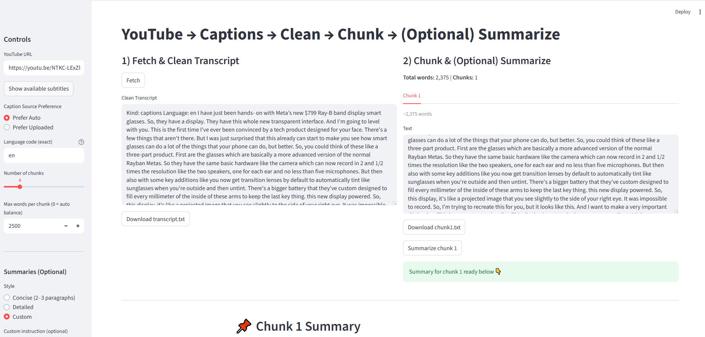
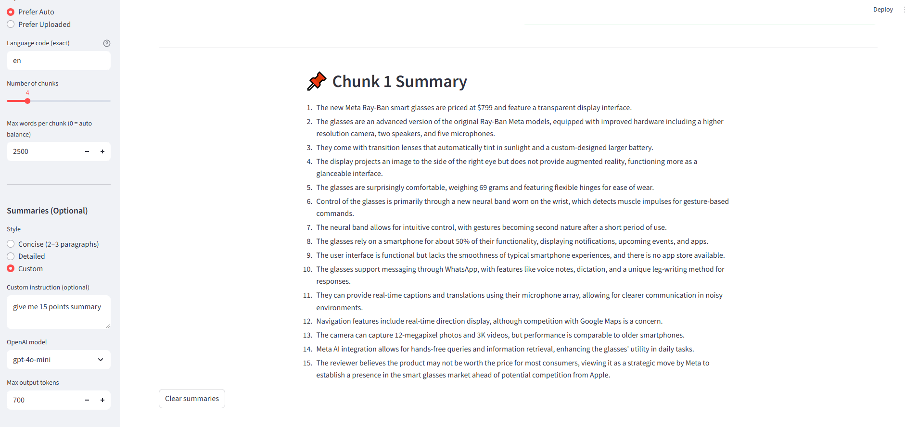

# YouTube Summarizer 🎥📝


**Link:**

https://youtubesummarizer-ai.streamlit.app/





An AI-powered web app that lets you paste a YouTube link and instantly get a **concise summary** of the video.
 Built with **Streamlit** for the UI, **YouTube transcript extraction** for video text, and **LLMs (e.g., OpenAI GPT)** for natural-language summarization.

------

## 🔍 How It Works

1. **Input**: User pastes a YouTube video URL.
2. **Transcript Extraction**:
   - The app fetches the transcript (when available) using the YouTube Transcript API.
   - If a transcript is not available, fallback options can be explored (e.g., audio-to-text).
3. **Chunking & Processing**:
   - Long transcripts are split into manageable chunks.
   - Chunks are sent to the LLM for processing.
4. **Summarization**:
   - Each chunk is summarized with the AI model.
   - Summaries are combined into a **final cohesive summary**.
5. **Output**: A clear, easy-to-read summary is displayed in the Streamlit app.

------

## 🛠️ Technology Stack

- **Frontend/UI**: Streamlit
- **Transcript Retrieval**: [youtube-transcript-api](https://pypi.org/project/youtube-transcript-api/)
- **Summarization**: Large Language Model (e.g. [OpenAI GPT](https://platform.openai.com/))
- **Backend Language**: Python 3
- **Deployment**: Streamlit Community Cloud (or self-hosted)

------

## ✨ Key Elements

- **Streamlit Interface**: Simple form where user pastes a YouTube link.
- **Error Handling**: Detects when transcripts are missing or videos are too long.
- **Chunking Strategy**: Splits transcript to fit within LLM context window.
- **AI Summarizer**: Uses API call to condense text into key insights.
- **Scalable Design**: Can be extended to support multi-language summaries, keyword extraction, or Q&A.

------

## ⚙️ Installation & Setup

Clone the repo:

```
git clone https://github.com/rchak007/youtubeSummarizer.git
cd youtubeSummarizer
```

Create and activate a virtual environment (optional but recommended):

```
python3 -m venv venv
source venv/bin/activate   # Mac/Linux
venv\Scripts\activate      # Windows
```

Install dependencies:

```
pip install -r requirements.txt
```

Set up API key (for OpenAI or chosen LLM provider):
 Create a `.streamlit/secrets.toml` file:

```
OPENAI_API_KEY="your_api_key_here"
```

------

## ▶️ Run Locally

```
streamlit run app.py
```

Then open in browser: http://localhost:8501

------

## ☁️ Deployment on Streamlit Cloud

1. Push changes to GitHub:

   ```
   git add .
   git commit -m "ready for Streamlit Cloud"
   git push origin main
   ```

2. Go to Streamlit Cloud.

3. Select this repo, branch, and `app.py`.

4. Add your API keys in **App Settings → Secrets**.

5. Deploy 🚀





