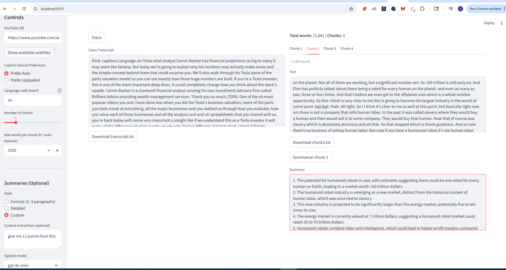

# youtubeV2 – YouTube Transcript & Summarizer

This app takes a YouTube URL, fetches captions (uploaded or auto), cleans them,
splits into chunks, and optionally summarizes with OpenAI.

## Features
- Fetch captions with `yt-dlp`
- Clean and normalize transcript (removes timestamps & tags)
- Split into chunks (word-based)
- Summarize with OpenAI (`gpt-4o-mini` or `gpt-4o`)
- Download transcript or chunks

## Local Setup
```bash
git clone https://github.com/YOURNAME/youtubeV2.git
cd youtubeV2
conda create -n ytcap python=3.11 -y
conda activate ytcap
pip install -r requirements.txt

```



